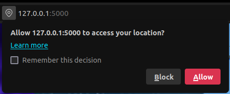
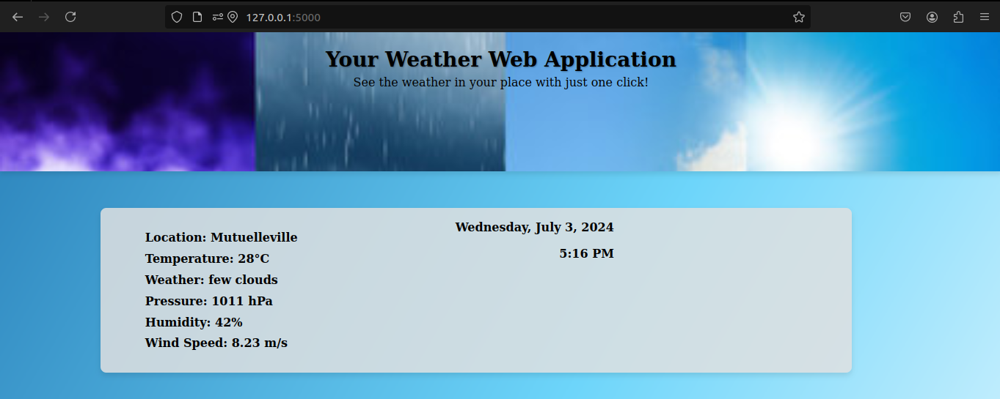
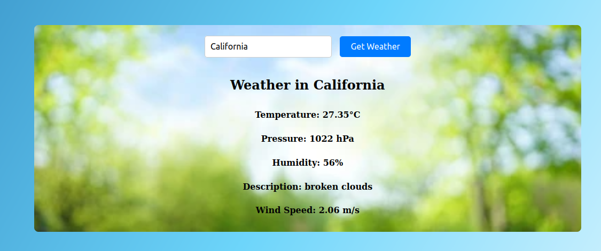
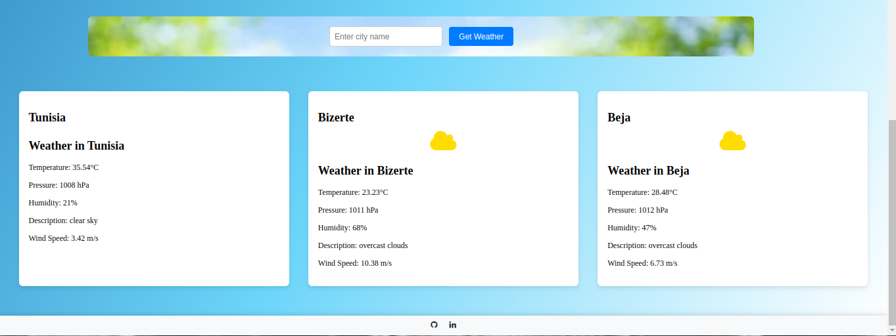

# My Flask Weather App

Welcome to my Flask Weather App project.

# Project Name

A simple web application to display the current weather in various cities, built with Python, Flask and an API key from openweather. 

## Installation and Setup Instructions
Clone this repository. You will need python3, Flask and a free API key from openweather.

# Installation:

pip install flask

pip install requests

# To start the server u need to run the following command

python3 app.py

Web browsers provide a geolocation API that allows web apps to access the user's location data, which i actually used to determine the user's loacation.

## U need to enable the browser location API first 

# See the weather where you are with me !

# make some searchs !

# most commonly searched places !

## ALL IN JUST ONE CLICK !

